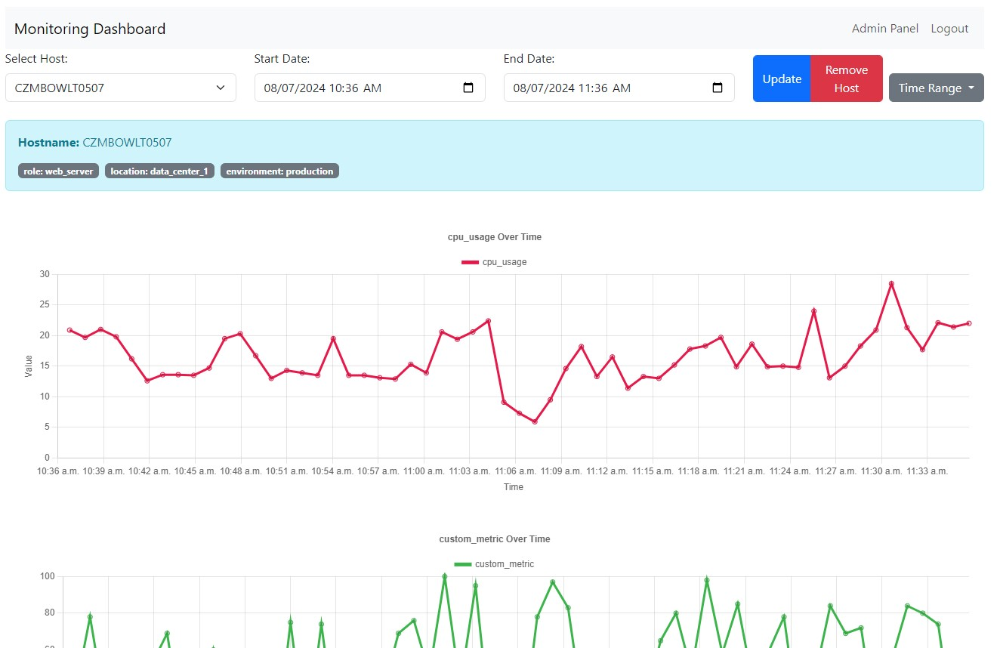

# Nakulos
नागराज-भक्षकः नकुलः

This is an advanced, scalable monitoring system built with Python and Tornado. It consists of a server that collects and stores metrics, and a client that gathers and sends metrics to the server.



## Features

- 100% Python implementation - absolutely no PHP or other legacy languages in sight
- Modern, from-the-ground-up design - not built on a 20-year-old core
- Server-client architecture for distributed monitoring
- Shared-secret signature-based communication between server and client
- Extensible metric collection through custom Python scripts
- All metrics are implemented natively in Python, allowing for easy customization and extension
- PostgreSQL database for robust and scalable storage of metrics
- In-memory queue system for efficient metric processing
- Client-side buffering for resilience against network issues
- Advanced data aggregation for handling thousands of hosts
- RESTful API for fetching latest metrics and historical data
- Automatic cleanup and aggregation of old data
- Configurable alert system with support for downtimes
- Interactive dashboard with real-time updates
- URL-based host selection for easy sharing and bookmarking
- Host tagging system for better organization
- Admin interface for managing clients and uploading new metrics
- Data simulation tool for testing and development
- Flexible data management, including the ability to selectively delete metrics when needed
- Pure Python implementation, making it easy to understand, modify, and extend the entire system
- Dynamic metric selection with perioid rediscovery and remote or local configuration
- End-to-end monitoring including Selenium, Autoit, PyAutoGUI supporting elements, positional clicking, bitmap synchronization (OCR)

## Requirements

- Python 3.7+
- Tornado web framework
- PostgreSQL database
- psycopg2-binary (PostgreSQL adapter for Python)
- Chart.js (for dashboard visualizations)

## Installation

1. Clone this repository or download the source files.
2. Install the required packages:
   ```
   pip install tornado psycopg2-binary
   ```
3. Ensure you have PostgreSQL installed and running.

## Setup

1. Server Setup:
   - Create a `server_config.json` file with your database and server settings.
   - Run the server using: `python server.py`

2. Client Setup:
   - Create a metrics directory in the same location as client.py
   - Add custom Python scripts to the metrics directory for each metric you want to collect
   - Configure `client_config.json` with appropriate settings (see Configuration section)
   - Run the client using: `python client.py`

## Configuration

### Client Configuration

Update your `client_config.json` file to include the following new fields:

```json
{
    "client_id": "",
    "server_url": "http://localhost:8888",
    "default_interval": 60,
    "metrics_dir": "./metrics",
    "secret_key": "your_secret_key",
    "active_metrics": ["cpu_usage", "memory_usage", "disk_usage"],
    "metric_intervals": {
        "cpu_usage": 30,
        "memory_usage": 60,
        "disk_usage": 300
    },
    "tags": {
        "environment": "production",
        "role": "webserver"
    }
}
```

- `active_metrics`: List of metrics that should be collected. Only metrics in this list will be gathered and sent to the server.
- `metric_intervals`: Custom collection intervals for specific metrics (in seconds). If not specified, the `default_interval` will be used.

### Adding Custom Metrics

1. Create a new Python file in the `metrics` directory (e.g., `custom_metric.py`).
2. Implement a `collect()` function that returns the metric value:

   ```python
   def collect():
       # Your metric collection logic here
       metrics = {"system_1": numeric_value_1,
                  "system_2": numeric_value_2
                 }
       return metrics            
   ```

3. Add the metric name to the `active_metrics` list in `client_config.json`.

### Enabling/Disabling Metrics

To enable or disable metrics without restarting the client:

1. Update the `active_metrics` list in `client_config.json`.
2. The client will automatically detect the change and adjust its metric collection accordingly on the next update cycle.

## Usage

### Dashboard

Access the dashboard at `http://localhost:8888/dashboard`. Features include:
- Real-time metric visualizations
- Host selection with URL-based sharing
- Alert configuration and management
- Downtime scheduling

### Admin Interface

Access the admin interface at `http://localhost:8888/admin`. Features include:
- Client configuration management
- Metric script uploading
- Host tag management
- Active metric configuration

## API Endpoints

- `GET /`: Check if the server is running
- `POST /metrics`: Submit metrics (used by the client)
- `GET /fetch/latest`: Get the latest metrics for all hosts
- `GET /fetch/history/<hostname>/<metric_name>`: Get historical data for a specific metric
- `GET /fetch/hosts`: Get a list of all hosts
- `POST /alert_config`: Configure alerts
- `POST /alert_state`: Update alert state
- `GET /downtime`: Get downtime information
- `POST /downtime`: Schedule a downtime
- `GET /fetch/recent_alerts`: Get recent alerts
- `POST /aggregate`: Trigger manual data aggregation
- `POST /remove_host`: Remove a host from the system
- `POST /update_tags`: Update tags for a host
- `GET /client_config`: Fetch client configuration
- `POST /client_config`: Register or update client configuration

## Commercial Use 

Nakulos is available for commercial use under a separate commercial license. Companies interested in using Nakulos for their monitoring needs can contact us at sales@nakulos.com to discuss pricing and support options. We offer flexible plans tailored to the specific requirements of businesses of all sizes.

Benefits of the commercial plan include:
- Priority support and dedicated account management 
- Access to additional enterprise features and integrations
- SLA guarantees for uptime and performance
- Assistance with setup, migration, and customization
- Option for on-premises or private cloud deployment

Please note that commercial use of Nakulos without a valid commercial license is not permitted under the open-source license detailed below.

## Troubleshooting

- If metrics are not being collected, check the `active_metrics` list in your client configuration.
- Ensure that all custom metric scripts have a `collect()` function.
- Check the client logs for any errors related to metric collection or script loading.

## Contributing

Contributions are welcome! Please feel free to submit a Pull Request.

## License 

This project is licensed under the Creative Commons Attribution-NonCommercial 4.0 International License (CC BY-NC 4.0).

For more details about this license, please visit:
https://creativecommons.org/licenses/by-nc/4.0/